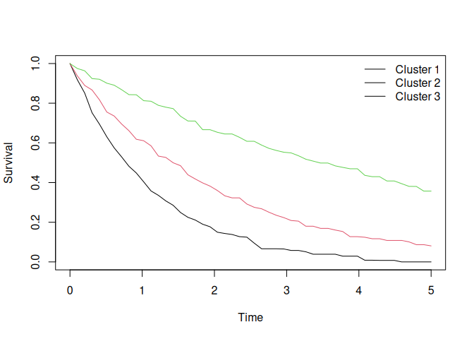
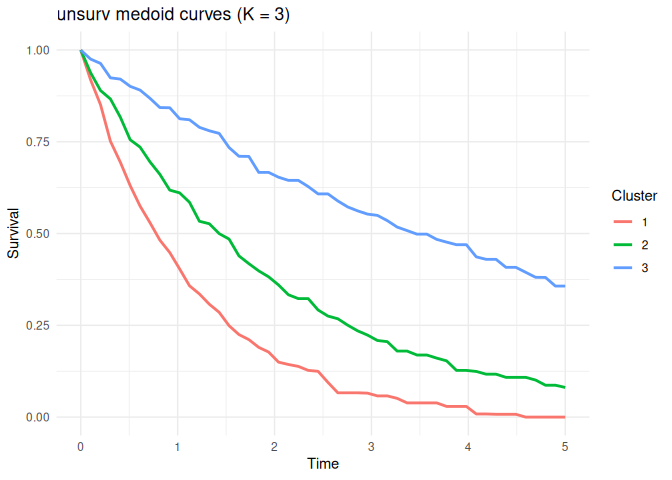

unsurv: Unsupervised Clustering of Individualized Survival Curves
================

# unsurv

<!-- badges: start -->
<!-- CRAN status (activate after submission) -->
<!-- [](https://CRAN.R-project.org/package=unsurv) -->
<!-- R CMD check -->
<!-- [](https://github.com/ielbadisy/unsurv/actions) -->
<!-- License -->

[](LICENSE)

<!-- badges: end -->

`unsurv` provides tools for *unsupervised clustering of individualized
survival curves* using a medoid-based (PAM) algorithm. It is designed
for applications where each observation is represented by a full
survival probability trajectory over time, such as:

- survival model predictions
- individualized survival curves from Cox or deep learning models
- dynamic risk trajectories
- multi-omics prognostic profiles

The package provides:

- Medoid-based clustering of survival curves
- Automatic selection of number of clusters via silhouette
- Support for weighted L1 and L2 distances
- Prediction of cluster membership for new curves
- Stability assessment via resampling and Adjusted Rand Index
- Visualization tools

# Installation

## From GitHub

``` r
install.packages("remotes")
remotes::install_github("ielbadisy/unsurv")
```

## From CRAN (after submission)

``` r
install.packages("unsurv")
```

# Overview

The core function is:

``` r
unsurv()
```

which clusters survival curves represented as an `n × m` matrix:

- rows = individuals
- columns = survival probabilities at time points

# Example: Clustering survival curves

``` r
library(unsurv)

set.seed(123)

n <- 100
Q <- 50
times <- seq(0, 5, length.out = Q)

rates <- c(0.2, 0.5, 0.9)
group <- sample(1:3, n, TRUE)

S <- sapply(times, function(t)
  exp(-rates[group] * t)
)

S <- S + matrix(rnorm(n * Q, 0, 0.01), nrow = n)
S[S < 0] <- 0
S[S > 1] <- 1

fit <- unsurv(S, times, K = NULL, K_max = 6)

fit
#> unsurv (PAM) fit
#>   K:3
#>   distance:L2 silhouette_mean:0.915
#>   n:100 Q:50
```

# Plot cluster medoids

``` r
plot(fit)
```

<!-- -->

Each line represents the medoid survival curve for a cluster.

# Predict cluster membership for new curves

``` r
predict(fit, S[1:5, ])
#> [1] 1 1 1 2 1
```

# Stability assessment

Cluster stability can be evaluated using resampling:

``` r
stab <- unsurv_stability(
  S, times, fit,
  B = 20,
  frac = 0.7,
  mode = "subsample"
)

stab$mean
#> [1] 0.9384743
```

Higher values indicate more stable clustering.

# Using ggplot visualization

``` r
library(ggplot2)
library(unsurv)
autoplot(fit)
```

<!-- -->

# Methodological details

Given survival curves:

$$
S_i(t_1), S_i(t_2), \dots, S_i(t_m)
$$

the algorithm:

1.  Optionally enforces monotonicity
2.  Applies weighted feature transformation
3.  Computes pairwise distances (L1 or L2)
4.  Applies PAM clustering
5.  Selects optimal K via silhouette (if not specified)

Cluster medoids represent prototype survival profiles.

# Typical workflow

``` r
fit <- unsurv(S, times)

clusters <- fit$clusters

pred <- predict(fit, new_S)

stab <- unsurv_stability(S, times, fit)
```

# Vignette

A full walkthrough (simulation, fitting, visualization, prediction,
stability) is available in the vignette:

``` r
vignette("unsurv-intro", package = "unsurv")
```

# Applications

**unsurv** is useful for:

- Patient stratification
- Risk phenotype discovery
- Prognostic subgroup identification
- Deep survival model interpretation
- Precision medicine

# Relationship to other methods

Unlike clustering on covariates, **unsurv clusters on the survival
function itself**, enabling:

- Direct interpretation of risk trajectories
- Robust clustering independent of feature space
- Model-agnostic analysis

# Package structure

Core functions:

| Function         | Description          |
|------------------|----------------------|
| unsurv           | fit clustering model |
| predict          | assign new curves    |
| plot             | visualize medoids    |
| summary          | summarize clustering |
| unsurv_stability | evaluate stability   |
| autoplot         | ggplot visualization |

# Citation

If you use unsurv, please cite:

``` r
citation("unsurv")
#> To cite package 'unsurv' in publications use:
#> 
#>   EL BADISY I (2026). _unsurv: Unsupervised Clustering of
#>   Individualized Survival Curves_. R package version 0.1.0.
#> 
#> A BibTeX entry for LaTeX users is
#> 
#>   @Manual{,
#>     title = {unsurv: Unsupervised Clustering of Individualized Survival Curves},
#>     author = {Imad {EL BADISY}},
#>     year = {2026},
#>     note = {R package version 0.1.0},
#>   }
```

# License

MIT License © Imad EL BADISY

# Development status

- Stable core implementation

- Full test suite

- CRAN submission ready

# Links

GitHub: <https://github.com/ielbadisy/unsurv>
